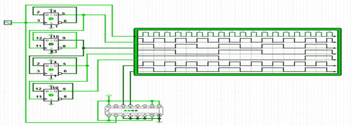
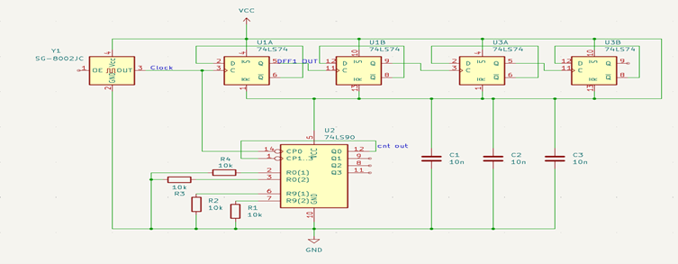
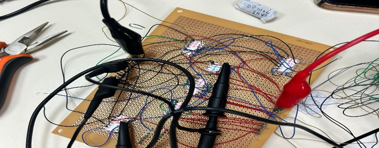
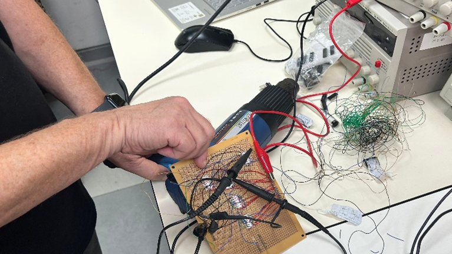
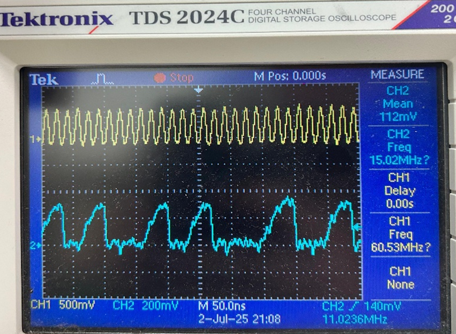
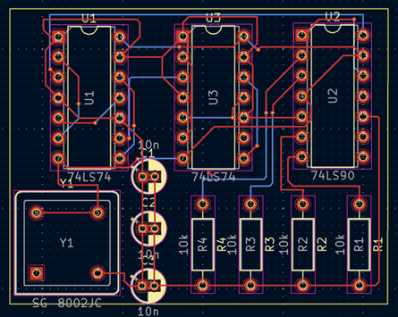
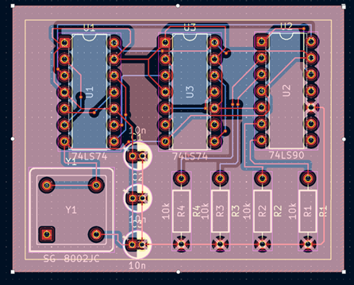
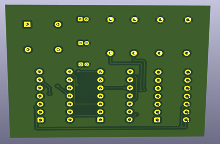
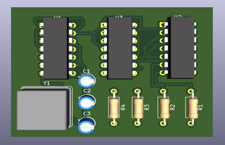

# High-Frequency Frequency Divider — Introduction to Board Design (Course Project)

> Frequency-division of a fast clock (~60.5 MHz) using **SN74LS90 / DM74LS90** and a **74LS74** flip-flop chain. Built on a **Wire-Wrap** prototype, characterized on a scope/logic analyzer, and then migrated to a **KiCad** PCB with a solid ground plane. Measured crosstalk reduced from ~50 mV → ~20 mV → ~10 mV → ~5 mV.

**Date:** 9-Aug-2025  
**Instructor:** Norberto Adrian Katz  
**Team:** Francis Aboud, Bashara Habib, Maria Nakhala, Tatiana Abu Shakra

---

- **Full Project Report (PDF)**  
  [`docs/project-report.pdf`](docs/project-report.pdf)

---

## 1) Project Goal

Design and validate a divider that operates reliably **above 30 MHz**, compare alternative implementations, and mitigate noise/jitter so the output is clean, synchronous, and repeatable.

**Targets**
- Divider for a fast clock input (>30 MHz).
- Compare:
  1) **SN74LS90** counter
  2) **DM74LS90** counter
  3) **74LS74** D-flip-flop chain (vendor variant used: GD74LS74)
- Characterize behavior at high frequency; identify weaknesses (crosstalk, jitter) and fix them.

**Concept**
- Input clock feeds either an asynchronous counter (÷4) or a D-FF chain (each stage ÷2). The output is a lower, stable frequency for downstream logic.

---

## 2) Design & Simulation

- **Flip-flop chain:** four cascaded **74LS74** D-FF stages (each ÷2).
- **Asynchronous counter:** **74LS90** configured for **÷4**.
- **Verification:** timing-diagram inspection and logic checks with a logic analyzer/oscilloscope at **>30 MHz**.

**Upgraded schematic (KiCad)**  

---

## 3) Wire-Wrap Implementation & Measurements

Prototype photos:

**Observed behavior**
- Correct division: **÷4 ≈ 15.02 MHz** from **~60.5 MHz** input.
- Noticeable **crosstalk** in dense wiring (spikes ~**50 mV** around edges).

**Scope snapshot (Tektronix TDS 2024C)**  
*CH2 (yellow): clock ≈ 60.53 MHz, CH1 (blue): divided output ≈ 15.02 MHz.*

---

## 4) Interference & Noise Analysis

- **FF outputs:** “softer” distortion (rounded edges, small ripples) due to edge-rate limits, parasitics, and long leads.
- **Counter output (SN74LS90):** sharper spikes consistent with **crosstalk** (parallel runs, weak return path, no shielding).

---

## 5) Noise Mitigation (Measured)

| Step | Action | Noise (mVp-p) | Notes |
|---|---|---:|---|
| 1 | Add **three decoupling capacitors** (VCC↔GND near the counter) | ~50 → **~20** | Smoother waveform, fewer sharp spikes |
| 2 | **Shorten & re-route** Wire-Wrap leads; separate fast nets | ~20 → **~10** | Crisper edges; fewer intermediate swings |
| 3 | Add **four pull-down resistors** on sensitive inputs | ~10 → **~5** | Stable, symmetric output; no “ghost” toggles |

**Result:** clean, stable output at **~15 MHz** after all three steps.

---

## 6) PCB Design (KiCad)

Routed layout (top) and ground-plane view:

3D previews:

**Design choices**
- **Placement:** short paths clock → FFs → counter; decouplers tight to VCC/GND pins.
- **Two-layer routing:** fast signals on one layer; power/returns on the other; wider power traces.
- **Continuous GND plane:** lower inductance, suppressed crosstalk/EMI.
- **Integrated fixes:** on-board decoupling and pull-downs at best-practice locations.

---

## 7) Conclusions

- High-frequency digital work is sensitive to **crosstalk** and wiring geometry (especially with **Wire-Wrap**).
- Combining **passives** (caps, pull-downs) with **physical organization** (short, separated runs; solid return paths) yields large, measurable gains.
- Noise reduced from **~50 mV → ~5 mV p-p**, achieving a clean, stable **~15.02 MHz** output from **~60.5 MHz** input.
- Migrating to a **PCB** with a solid **GND plane** further improves reliability and repeatability.

---

## Repository Layout

├── docs/ # Report, images, timing diagrams
├── images/ # Photos, timing plots, PCB renders
├── LICENSES/ # Per-folder licenses
└── README.md

